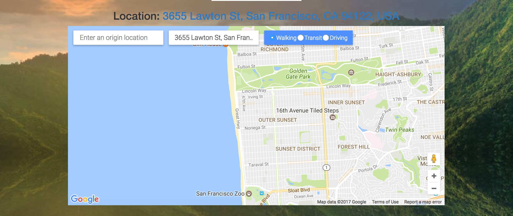

## Description
Pocket Passport is a travel photo guide that allows users to find travel destinations and save pictures. The concept is similar to Travel for Pinterest. Users can also see Yelp and Googlemaps information of that picture. The pictures are sourced by the Flickr API. 

## Table of Contents
* [Technologies Used](#technologiesused)
* [Features](#features)
* [Possible Improvements](#improvements)
* [Author](#author)

## <a name="technologiesused"></a>Technologies Used

<b>Backend:</b> Python, Flask, PostgreSQL, SQLAlchemy<br/>
<b>Frontend:</b> JavaScript, jQuery, AJAX, Jinja2, Bootstrap, HTML5, CSS3, Masonry<br/>
<b>APIs:</b> Flickr, Yelp, Googlemaps<br/>

## <a name="features"></a>Features

Users can save photos to their profile, view pictures based on different categories, and see Googlemaps and Yelp information. 

The home page shows saved pictures
 "Home Page")

After entering a location in the search bar, users can choose a category 
 "Select categories of pictures to view"

Users can then like or unlike pictures to save to their profile
 "Like or unlike pictures"

Click the picture to view more details
 "Yelp details"

See googlemaps location
 "Googlemaps directions"
## <a name="improvements"></a>Future Improvements

* I would like to add an infinite scroll/pagination 
* Expand the app to allow friends to share photos with each other and view profiles more easily
* Add modals for pictures to pop up. 

## <a name="author"></a>Author
Hello! My name is [Christina Gin](https://www.linkedin.com/in/christina-gin) and I am a software engineer. I received training from Hackbright Academy, an engineering bootcamp for women in San Francisco. Thanks for reading!

Clone or fork this repo:

Create and activate a virtual environment inside your directory:

```
virtualenv env
source env/bin/activate
```

Install the dependencies:

```
pip install -r requirements.txt
```
Sign up to use the Flickr API, Yelp API, and Googlemaps API 

Save your API keys in a file called <kbd>secrets.sh</kbd> using this format:
```
export APP_ID="YOUR_KEY_GOES_HERE"

Source your keys from your secrets.sh file into your virtual environment:

```
source secrets.sh
```

Set up the database:

```
python model.py
```

Run the app:

```
python server.py
```

You can now navigate to 'localhost:5000/' to access Pocket Passport